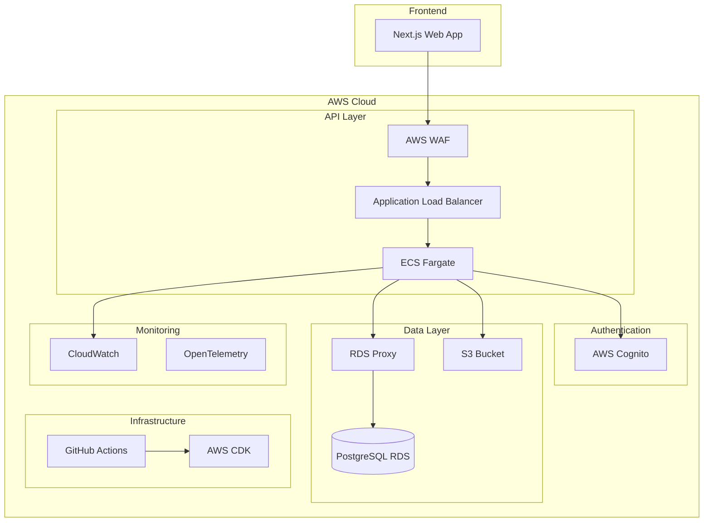
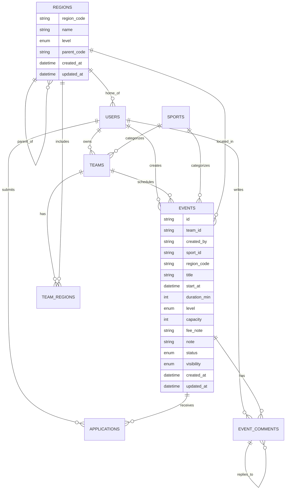

# 設計書

## 概要

Creweeは地域のスポーツチーム代表者が練習/試合の参加者を素早く集め、プレイヤーが手軽に参加できる場を提供するスポーツ特化のマッチングプラットフォームのMVPです。

**主要目的:**
- 地域のスポーツチーム代表者が練習/試合の参加者を素早く集められる
- 固定チーム未所属のプレイヤーが予定に合わせて参加できる場を提供
- 将来的にはスポーツ特化のSNS機能でオンラインスポーツ観戦をより楽しめるプラットフォームに発展

**ターゲットユーザー:**
- チーム代表者（オーガナイザー）：施設を押さえ、日程を組む人
- プレイヤー（参加希望者）：固定チーム未所属でも、予定に合わせて参加したい人

AWS上でモダンなWebアプリケーションとして構築し、スケーラブルで安全なアーキテクチャを採用します。

## アーキテクチャ

### システム全体構成



### 技術スタック

- **フロントエンド**: Next.js 15.4 (App Router), TypeScript, Tailwind CSS
- **バックエンド**: Go 1.24+, Echo Framework, sqlc
- **データベース**: PostgreSQL (Amazon RDS + RDS Proxy)
- **実行環境**: ECS Fargate
- **認証**: AWS Cognito
- **インフラ**: AWS CDK (TypeScript)
- **CI/CD**: GitHub Actions
- **ファイルストレージ**: Amazon S3
- **マイグレーション**: golang-migrate/migrate
- **監視**: CloudWatch + OpenTelemetry

## コンポーネントと インターフェース

### 1. 認証システム

#### AWS Cognito設定
```yaml
UserPool:
  - Email認証必須
  - 18歳以上制限（カスタム属性）
  - パスワードポリシー: 8文字以上、大小英数字記号
  - MFA: 無効（MVP）
  
UserPoolClient:
  - Authorization Code Grant
  - PKCE有効
  - Refresh Token: 30日
```

#### JWT検証フロー
```go
type AuthMiddleware struct {
    CognitoRegion string
    UserPoolID    string
}

func (a *AuthMiddleware) ValidateToken(token string) (*UserClaims, error) {
    // JWT署名検証
    // Cognito公開鍵での検証
    // クレーム抽出（sub, email, email_verified）
}
```

### 2. データベース設計

#### 主要エンティティ

```go
type User struct {
    ID               string    `db:"id"`
    Email            string    `db:"email"`
    Name             string    `db:"name"`
    EmailVerifiedAt  *time.Time `db:"email_verified_at"`
    HomeRegionCode   string    `db:"home_region_code"`
    CreatedAt        time.Time `db:"created_at"`
    UpdatedAt        time.Time `db:"updated_at"`
}

type Team struct {
    ID            string    `db:"id"`
    OwnerUserID   string    `db:"owner_user_id"`
    SportID       string    `db:"sport_id"`
    Name          string    `db:"name"`
    CreatedAt     time.Time `db:"created_at"`
    UpdatedAt     time.Time `db:"updated_at"`
}

type Sport struct {
    ID        string    `db:"id"`
    Code      string    `db:"code"`
    Name      string    `db:"name"`
    IsActive  bool      `db:"is_active"`
    CreatedAt time.Time `db:"created_at"`
    UpdatedAt time.Time `db:"updated_at"`
}

type Region struct {
    RegionCode  string    `db:"region_code"`  // JISコード
    Name        string    `db:"name"`
    Level       string    `db:"level"`        // PREFECTURE, MUNICIPALITY
    ParentCode  *string   `db:"parent_code"` // 都道府県はNULL
    CreatedAt   time.Time `db:"created_at"`
    UpdatedAt   time.Time `db:"updated_at"`
}

type EventStatus string
type EventVisibility string
type SkillLevel string

const (
    EventStatusOpen     EventStatus = "OPEN"
    EventStatusClosed   EventStatus = "CLOSED"
    EventStatusCanceled EventStatus = "CANCELED"
)

const (
    VisibilityPublic   EventVisibility = "PUBLIC"
    VisibilityUnlisted EventVisibility = "UNLISTED"
)

const (
    LevelBeginner     SkillLevel = "BEGINNER"
    LevelIntermediate SkillLevel = "INTERMEDIATE"
    LevelAdvanced     SkillLevel = "ADVANCED"
)

type Event struct {
    ID           string          `db:"id"`
    TeamID       string          `db:"team_id"`
    CreatedBy    string          `db:"created_by"`
    SportID      string          `db:"sport_id"`
    RegionCode   string          `db:"region_code"`
    Title        string          `db:"title"`
    StartAt      time.Time       `db:"start_at"`
    DurationMin  int             `db:"duration_min"`
    Level        SkillLevel      `db:"level"`
    Capacity     int             `db:"capacity"`
    FeeNote      string          `db:"fee_note"`
    Note         string          `db:"note"`
    Status       EventStatus     `db:"status"`
    Visibility   EventVisibility `db:"visibility"`
    CreatedAt    time.Time       `db:"created_at"`
    UpdatedAt    time.Time       `db:"updated_at"`
}

type ApplicationStatus string

const (
    ApplicationStatusPending   ApplicationStatus = "PENDING"
    ApplicationStatusAccepted  ApplicationStatus = "ACCEPTED"
    ApplicationStatusDeclined  ApplicationStatus = "DECLINED"
    ApplicationStatusCanceled  ApplicationStatus = "CANCELED"
    ApplicationStatusWaitlisted ApplicationStatus = "WAITLISTED"
)

type Application struct {
    ID              string            `db:"id"`
    EventID         string            `db:"event_id"`
    ApplicantUserID string            `db:"applicant_user_id"`
    Message         string            `db:"message"`
    Status          ApplicationStatus `db:"status"`
    CreatedAt       time.Time         `db:"created_at"`
    UpdatedAt       time.Time         `db:"updated_at"`
}

type EventComment struct {
    ID              string    `db:"id"`
    EventID         string    `db:"event_id"`
    AuthorUserID    string    `db:"author_user_id"`
    ParentCommentID *string   `db:"parent_comment_id"`
    Body            string    `db:"body"`
    Scope           string    `db:"scope"`           // PUBLIC
    IsPinned        bool      `db:"is_pinned"`
    IsSystemMessage bool      `db:"is_system_message"`
    CreatedAt       time.Time `db:"created_at"`
    UpdatedAt       time.Time `db:"updated_at"`
    DeletedAt       *time.Time `db:"deleted_at"`
}
```

#### インデックス戦略

```sql
-- 検索パフォーマンス最適化
CREATE INDEX idx_events_search ON events(status, start_at, sport_id, region_code);
CREATE INDEX idx_events_team_status ON events(team_id, status);
CREATE INDEX idx_applications_event_status ON applications(event_id, status);
CREATE INDEX idx_applications_user_status ON applications(applicant_user_id, status);

-- 一意制約
CREATE UNIQUE INDEX idx_applications_unique ON applications(event_id, applicant_user_id) WHERE status != 'CANCELED';
```

### 3. API設計

#### RESTful API構造

```yaml
Base URL: /api/v1

Authentication:
  - Header: Authorization: Bearer {cognito_access_token}
  - JWT検証ミドルウェア

Endpoints:
  # マスタデータ
  GET /sports                    # スポーツ一覧
  GET /regions                   # 地域一覧（階層対応）
  
  # ユーザー
  GET /me                        # プロフィール取得
  PATCH /me                      # プロフィール更新
  
  # チーム
  GET /teams                     # チーム一覧（owner=me対応）
  POST /teams                    # チーム作成
  GET /teams/{id}                # チーム詳細
  PATCH /teams/{id}              # チーム更新
  DELETE /teams/{id}             # チーム削除
  
  # イベント
  GET /events                    # イベント検索・一覧
  POST /events                   # イベント作成
  GET /events/{id}               # イベント詳細
  PATCH /events/{id}             # イベント更新
  DELETE /events/{id}            # イベント削除
  
  # 応募
  GET /events/{id}/applications  # 応募一覧（主催者のみ）
  POST /events/{id}/applications # 応募作成
  PATCH /applications/{id}       # 応募ステータス更新
  
  # コメント（応募スレッドに紐づく公開メッセージ）
  GET /events/{id}/comments      # イベントコメント一覧
  POST /events/{id}/comments     # コメント作成
  PATCH /comments/{id}           # コメント更新（ピン留め変更含む）
```

#### レスポンス形式

```go
type APIResponse struct {
    Data    interface{} `json:"data,omitempty"`
    Error   *APIError   `json:"error,omitempty"`
    Meta    *Meta       `json:"meta,omitempty"`
}

type APIError struct {
    Code    string `json:"code"`
    Message string `json:"message"`
    Details string `json:"details,omitempty"`
}

type Meta struct {
    Total  int `json:"total,omitempty"`
    Limit  int `json:"limit,omitempty"`
    Offset int `json:"offset,omitempty"`
}
```

#### 状態遷移とバリデーションルール

```go
// イベントステータス遷移ルール
func (s *EventService) ValidateStatusTransition(currentStatus, newStatus EventStatus, startAt time.Time) error {
    now := time.Now()
    
    // 開始時刻以降は編集禁止
    if now.After(startAt) {
        return ErrEventStarted
    }
    
    switch currentStatus {
    case EventStatusOpen:
        // OPEN → CLOSED, CANCELED のみ許可
        if newStatus != EventStatusClosed && newStatus != EventStatusCanceled {
            return ErrInvalidStatusTransition
        }
    case EventStatusClosed:
        // CLOSED → CANCELED のみ許可（再OPEN不可）
        if newStatus != EventStatusCanceled {
            return ErrInvalidStatusTransition
        }
    case EventStatusCanceled:
        // CANCELED からの復帰不可
        return ErrInvalidStatusTransition
    }
    
    return nil
}

// PATCH /events/{id} のバリデーション
func (h *EventHandler) UpdateEvent(c echo.Context) error {
    eventID := c.Param("id")
    userID := c.Get("user_id").(string)
    
    var req UpdateEventRequest
    if err := c.Bind(&req); err != nil {
        return err
    }
    
    // 現在のイベント情報を取得
    event, err := h.eventService.GetEvent(c.Request().Context(), eventID)
    if err != nil {
        return err
    }
    
    // 権限チェック
    if !h.eventService.CanEditEvent(userID, event) {
        return ErrForbidden
    }
    
    // 状態遷移チェック
    if req.Status != nil {
        if err := h.eventService.ValidateStatusTransition(
            event.Status, *req.Status, event.StartAt); err != nil {
            return err
        }
    }
    
    // 開始時刻以降は承認処理も禁止
    if time.Now().After(event.StartAt) {
        return ErrEventStarted
    }
    
    return h.eventService.UpdateEvent(c.Request().Context(), eventID, req)
}
```

### 4. フロントエンド設計

#### ページ構成

```
/                          # ホーム・イベント検索
/events/{id}               # イベント詳細
/events/new                # イベント作成
/events/{id}/edit          # イベント編集
/teams                     # マイチーム一覧
/teams/new                 # チーム作成
/teams/{id}                # チーム詳細
/teams/{id}/edit           # チーム編集
/applications              # マイ応募一覧
/profile                   # プロフィール
/login                     # ログイン
/register                  # 新規登録
```

#### 状態管理

```typescript
// Zustand使用
interface AppState {
  user: User | null;
  teams: Team[];
  events: Event[];
  applications: Application[];
  
  // Actions
  setUser: (user: User | null) => void;
  fetchTeams: () => Promise<void>;
  fetchEvents: (filters: EventFilters) => Promise<void>;
}

// React Query使用（サーバー状態）
const useEvents = (filters: EventFilters) => {
  return useQuery({
    queryKey: ['events', filters],
    queryFn: () => api.getEvents(filters),
    staleTime: 5 * 60 * 1000, // 5分
  });
};
```

## データモデル

### エンティティ関係図



### ビジネスルール

```go
// 定員管理（承認レース対策）
func (s *ApplicationService) ApproveApplication(ctx context.Context, appID string, approverID string) error {
    return s.db.WithTx(ctx, func(tx *sql.Tx) error {
        // 1. 応募情報を取得
        app, err := s.queries.GetApplicationForUpdate(ctx, tx, appID)
        if err != nil {
            return err
        }
        
        // 2. イベント情報を排他ロックで取得
        event, err := s.queries.GetEventForUpdate(ctx, tx, app.EventID)
        if err != nil {
            return err
        }
        
        // 3. 権限チェック（チームオーナーまたはイベント作成者）
        if !s.canApproveApplication(approverID, event) {
            return ErrForbidden
        }
        
        // 4. 状態遷移チェック
        if err := s.validateApprovalTransition(app, event); err != nil {
            return err
        }
        
        // 5. 承認済み数を再計算
        acceptedCount, err := s.queries.CountAcceptedApplications(ctx, tx, event.ID)
        if err != nil {
            return err
        }
        
        if acceptedCount >= event.Capacity {
            return ErrCapacityExceeded
        }
        
        // 6. 承認処理
        if err := s.queries.UpdateApplicationStatus(ctx, tx, appID, "ACCEPTED"); err != nil {
            return err
        }
        
        // 7. 承認通知をイベントコメントに自動投稿（MVPはアプリ内のみ）
        return s.postApprovalNotification(ctx, tx, app, event)
    })
}

// MVPでの通知実装（アプリ内コメントのみ、メール配信は将来機能）
func (s *ApplicationService) postApprovalNotification(ctx context.Context, tx *sql.Tx, app Application, event Event) error {
    // 集合詳細テンプレートをイベントコメントに自動投稿
    // PRD準拠：「応募スレッドに紐づく公開メッセージ（質問/集合詳細）」
    gatheringDetails := fmt.Sprintf(`
【参加承認のお知らせ】
%sさんの参加が承認されました。

集合詳細：
- 日時: %s
- 場所: %s（%s）
- 持ち物: 運動できる服装、飲み物
- 参加費: %s
- 連絡先: 当日の緊急連絡は主催者まで

ご参加をお待ちしております！
    `, app.ApplicantName, 
       event.StartAt.Format("2006/01/02 15:04"), 
       event.LocationText, 
       event.RegionName,
       event.FeeNote)
    
    comment := EventComment{
        EventID:         event.ID,
        AuthorUserID:    event.CreatedBy, // 主催者からの投稿として
        Body:            gatheringDetails,
        Scope:           "PUBLIC",
        IsPinned:        true, // 重要な情報なのでピン留め
        IsSystemMessage: true, // システム生成メッセージ
    }
    
    return s.queries.CreateEventComment(ctx, tx, comment)
}

func (s *ApplicationService) validateApprovalTransition(app Application, event Event) error {
    // イベント開始後は承認不可
    if time.Now().After(event.StartAt) {
        return ErrEventStarted
    }
    
    // キャンセル済みイベントは承認不可
    if event.Status == EventStatusCanceled {
        return ErrEventCanceled
    }
    
    // 既に承認済み/却下済みは変更不可
    if app.Status != "PENDING" && app.Status != "WAITLISTED" {
        return ErrInvalidStatusTransition
    }
    
    return nil
}

// 権限チェック
func (s *EventService) CanEditEvent(userID, eventID string) (bool, error) {
    var event Event
    err := s.db.Preload("Team").First(&event, "id = ?", eventID).Error
    if err != nil {
        return false, err
    }
    
    // チームオーナーまたはイベント作成者
    return event.Team.OwnerUserID == userID || event.CreatedBy == userID, nil
}
```

## エラーハンドリング

### エラー分類と処理

```go
type ErrorCode string

const (
    ErrCodeValidation     ErrorCode = "VALIDATION_ERROR"
    ErrCodeNotFound       ErrorCode = "NOT_FOUND"
    ErrCodeUnauthorized   ErrorCode = "UNAUTHORIZED"
    ErrCodeForbidden      ErrorCode = "FORBIDDEN"
    ErrCodeCapacityFull   ErrorCode = "CAPACITY_FULL"
    ErrCodeDuplicateApp   ErrorCode = "DUPLICATE_APPLICATION"
    ErrCodeInternal       ErrorCode = "INTERNAL_ERROR"
)

func ErrorHandler() gin.HandlerFunc {
    return func(c *gin.Context) {
        c.Next()
        
        if len(c.Errors) > 0 {
            err := c.Errors.Last()
            
            switch e := err.Err.(type) {
            case *ValidationError:
                c.JSON(400, APIResponse{
                    Error: &APIError{
                        Code:    string(ErrCodeValidation),
                        Message: e.Message,
                        Details: e.Details,
                    },
                })
            case *NotFoundError:
                c.JSON(404, APIResponse{
                    Error: &APIError{
                        Code:    string(ErrCodeNotFound),
                        Message: "リソースが見つかりません",
                    },
                })
            default:
                c.JSON(500, APIResponse{
                    Error: &APIError{
                        Code:    string(ErrCodeInternal),
                        Message: "内部エラーが発生しました",
                    },
                })
            }
        }
    }
}
```

## テスト戦略

### テスト構成

```go
// 単体テスト
func TestApplicationService_ApproveApplication(t *testing.T) {
    tests := []struct {
        name           string
        setup          func(*gorm.DB)
        applicationID  string
        expectedError  error
    }{
        {
            name: "正常承認",
            setup: func(db *gorm.DB) {
                // テストデータ作成
            },
            applicationID: "test-app-id",
            expectedError: nil,
        },
        {
            name: "定員超過エラー",
            setup: func(db *gorm.DB) {
                // 定員満員のテストデータ
            },
            applicationID: "test-app-id",
            expectedError: ErrCapacityExceeded,
        },
    }
    
    for _, tt := range tests {
        t.Run(tt.name, func(t *testing.T) {
            db := setupTestDB(t)
            tt.setup(db)
            
            service := NewApplicationService(db)
            err := service.ApproveApplication(context.Background(), tt.applicationID)
            
            assert.Equal(t, tt.expectedError, err)
        })
    }
}

// 統合テスト
func TestEventAPI_CreateEvent(t *testing.T) {
    router := setupTestRouter()
    
    payload := map[string]interface{}{
        "team_id":     "test-team-id",
        "sport_id":    "test-sport-id",
        "title":       "テストイベント",
        "start_at":    "2024-12-01T10:00:00Z",
        "capacity":    10,
        "level":       "BEGINNER",
        "region_code": "13", // 東京都
    }
    
    w := httptest.NewRecorder()
    req := createAuthenticatedRequest("POST", "/api/v1/events", payload)
    router.ServeHTTP(w, req)
    
    assert.Equal(t, 201, w.Code)
    
    var response APIResponse
    json.Unmarshal(w.Body.Bytes(), &response)
    assert.NotNil(t, response.Data)
}
```

### E2Eテスト

```typescript
// Playwright使用
test('イベント作成から応募承認まで', async ({ page }) => {
  // ログイン
  await page.goto('/login');
  await page.fill('[data-testid=email]', 'organizer@example.com');
  await page.fill('[data-testid=password]', 'password123');
  await page.click('[data-testid=login-button]');
  
  // イベント作成
  await page.goto('/events/new');
  await page.fill('[data-testid=title]', 'テストサッカー');
  await page.selectOption('[data-testid=sport]', 'soccer');
  await page.fill('[data-testid=capacity]', '10');
  await page.click('[data-testid=create-button]');
  
  // 作成確認
  await expect(page.locator('[data-testid=success-message]')).toBeVisible();
});
```

## セキュリティ考慮事項

### 認証・認可

```go
// JWT検証ミドルウェア
func AuthMiddleware() gin.HandlerFunc {
    return func(c *gin.Context) {
        token := extractBearerToken(c.GetHeader("Authorization"))
        if token == "" {
            c.JSON(401, APIResponse{Error: &APIError{Code: "UNAUTHORIZED"}})
            c.Abort()
            return
        }
        
        claims, err := validateCognitoToken(token)
        if err != nil {
            c.JSON(401, APIResponse{Error: &APIError{Code: "INVALID_TOKEN"}})
            c.Abort()
            return
        }
        
        c.Set("user_id", claims.Subject)
        c.Set("email", claims.Email)
        c.Next()
    }
}

// CORS設定
func CORSMiddleware() gin.HandlerFunc {
    return cors.New(cors.Config{
        AllowOrigins:     []string{"https://crewee.example.com"},
        AllowMethods:     []string{"GET", "POST", "PATCH", "DELETE", "OPTIONS"},
        AllowHeaders:     []string{"Authorization", "Content-Type"},
        ExposeHeaders:    []string{"Content-Length"},
        AllowCredentials: true,
        MaxAge:           12 * time.Hour,
    })
}
```

### 入力検証

```go
type CreateEventRequest struct {
    TeamID     string    `json:"team_id" binding:"required,uuid"`
    SportID    string    `json:"sport_id" binding:"required,uuid"`
    Title      string    `json:"title" binding:"required,min=1,max=100"`
    StartAt    time.Time `json:"start_at" binding:"required"`
    Capacity   int       `json:"capacity" binding:"required,min=1,max=100"`
    Level      string    `json:"level" binding:"required,oneof=BEGINNER INTERMEDIATE ADVANCED"`
    RegionCode string    `json:"region_code" binding:"required"`
}

func (r *CreateEventRequest) Validate() error {
    if r.StartAt.Before(time.Now()) {
        return errors.New("開始時刻は未来の時刻を指定してください")
    }
    return nil
}
```

### レート制限

AWS WAFのRate-based ruleを使用してレート制限を実装：

```yaml
# AWS CDK設定
WebACL:
  Rules:
    - Name: RateLimitRule
      Priority: 1
      Statement:
        RateBasedStatement:
          Limit: 2000  # 5分間で2000リクエスト
          AggregateKeyType: IP
      Action:
        Block: {}
      VisibilityConfig:
        SampledRequestsEnabled: true
        CloudWatchMetricsEnabled: true
        MetricName: RateLimitRule

    - Name: APIRateLimitRule
      Priority: 2
      Statement:
        RateBasedStatement:
          Limit: 100  # 5分間で100リクエスト
          AggregateKeyType: IP
          ScopeDownStatement:
            ByteMatchStatement:
              SearchString: "/api/"
              FieldToMatch:
                UriPath: {}
              TextTransformations:
                - Priority: 0
                  Type: LOWERCASE
              PositionalConstraint: CONTAINS
      Action:
        Block: {}
```

## パフォーマンス最適化

### データベース最適化

```sql
-- 検索クエリ最適化
EXPLAIN ANALYZE 
SELECT e.*, t.name as team_name, s.name as sport_name
FROM events e
JOIN teams t ON e.team_id = t.id
JOIN sports s ON e.sport_id = s.id
WHERE e.status = 'OPEN'
  AND e.visibility = 'PUBLIC'  -- UNLISTED は検索対象外
  AND e.start_at >= NOW()
  AND e.sport_id = $1
  AND e.region_code = $2
ORDER BY e.start_at ASC
LIMIT 20 OFFSET $3;

-- RDS Proxy設定
RDS Proxy:
  MaxConnectionsPercent: 100
  MaxIdleConnectionsPercent: 50
  RequireTLS: true
  IdleClientTimeout: 1800  # 30分
  
-- PostgreSQL設定
max_connections = 100
shared_buffers = 256MB
effective_cache_size = 1GB
work_mem = 4MB

-- ENUM型定義
CREATE TYPE event_status AS ENUM ('OPEN', 'CLOSED', 'CANCELED');
CREATE TYPE event_visibility AS ENUM ('PUBLIC', 'UNLISTED');
CREATE TYPE skill_level AS ENUM ('BEGINNER', 'INTERMEDIATE', 'ADVANCED');
CREATE TYPE region_level AS ENUM ('PREFECTURE', 'MUNICIPALITY');
CREATE TYPE application_status AS ENUM ('PENDING', 'ACCEPTED', 'DECLINED', 'CANCELED', 'WAITLISTED');

-- 地域マスタ（JISコード準拠）
INSERT INTO regions (region_code, name, level, parent_code) VALUES
('01', '北海道', 'PREFECTURE', NULL),
('13', '東京都', 'PREFECTURE', NULL),
('27', '大阪府', 'PREFECTURE', NULL),
('1301', '千代田区', 'MUNICIPALITY', '13'),
('1302', '中央区', 'MUNICIPALITY', '13');
```

### キャッシュ戦略

```go
// Redis使用（将来）
type CacheService struct {
    redis *redis.Client
}

func (c *CacheService) GetEvents(key string) ([]Event, error) {
    val, err := c.redis.Get(context.Background(), key).Result()
    if err == redis.Nil {
        return nil, nil // キャッシュミス
    }
    
    var events []Event
    json.Unmarshal([]byte(val), &events)
    return events, nil
}

// フロントエンド - React Query
const useEvents = (filters: EventFilters) => {
  return useQuery({
    queryKey: ['events', filters],
    queryFn: () => api.getEvents(filters),
    staleTime: 5 * 60 * 1000, // 5分間キャッシュ
    cacheTime: 10 * 60 * 1000, // 10分間保持
  });
};
```

## 監視とログ

### ログ設計

```go
import (
    "go.opentelemetry.io/otel"
    "go.opentelemetry.io/otel/trace"
    "github.com/sirupsen/logrus"
)

func setupLogger() *logrus.Logger {
    logger := logrus.New()
    logger.SetFormatter(&logrus.JSONFormatter{})
    
    if os.Getenv("ENV") == "production" {
        logger.SetLevel(logrus.InfoLevel)
    } else {
        logger.SetLevel(logrus.DebugLevel)
    }
    
    return logger
}

// OpenTelemetry + CloudWatch統合
func setupTracing() {
    // AWS X-Ray Exporter設定
    exporter, err := xray.NewExporter(xray.WithRegion("ap-northeast-1"))
    if err != nil {
        log.Fatal(err)
    }
    
    tp := trace.NewTracerProvider(
        trace.WithBatcher(exporter),
        trace.WithResource(resource.NewWithAttributes(
            semconv.SchemaURL,
            semconv.ServiceNameKey.String("crewee-api"),
            semconv.ServiceVersionKey.String("1.0.0"),
        )),
    )
    
    otel.SetTracerProvider(tp)
}

// 構造化ログ with トレーシング
func logWithTrace(ctx context.Context, logger *logrus.Logger, userID, eventID, action string, c echo.Context) {
    span := trace.SpanFromContext(ctx)
    
    logger.WithFields(logrus.Fields{
        "user_id":    userID,
        "event_id":   eventID,
        "action":     action,
        "ip_address": c.RealIP(),
        "trace_id":   span.SpanContext().TraceID().String(),
        "span_id":    span.SpanContext().SpanID().String(),
    }).Info("Application approved")
}
```

### メトリクス

```go
// CloudWatch メトリクス + OpenTelemetry
import (
    "go.opentelemetry.io/otel/metric"
    "go.opentelemetry.io/otel/metric/global"
)

var (
    httpRequestsTotal metric.Int64Counter
    httpRequestDuration metric.Float64Histogram
    applicationApprovals metric.Int64Counter
    eventCreations metric.Int64Counter
)

func setupMetrics() {
    meter := global.Meter("crewee-api")
    
    httpRequestsTotal, _ = meter.Int64Counter(
        "http_requests_total",
        metric.WithDescription("Total number of HTTP requests"),
    )
    
    httpRequestDuration, _ = meter.Float64Histogram(
        "http_request_duration_seconds",
        metric.WithDescription("HTTP request duration in seconds"),
    )
    
    applicationApprovals, _ = meter.Int64Counter(
        "application_approvals_total",
        metric.WithDescription("Total number of application approvals"),
    )
    
    eventCreations, _ = meter.Int64Counter(
        "event_creations_total",
        metric.WithDescription("Total number of events created"),
    )
}

// CloudWatch アラーム設定
CloudWatchAlarms:
  - AlarmName: HighErrorRate
    MetricName: HTTPCode_Target_5XX_Count
    Threshold: 10
    ComparisonOperator: GreaterThanThreshold
    EvaluationPeriods: 2
    
  - AlarmName: HighLatency
    MetricName: TargetResponseTime
    Threshold: 2.0
    ComparisonOperator: GreaterThanThreshold
    EvaluationPeriods: 3
```

この設計書は、NotionのPRDに基づいてCreweeアプリケーションの技術的な実装方針を詳細に定義しています。モダンなWebアプリケーションのベストプラクティスを採用し、スケーラブルで保守性の高いシステムを構築できる設計となっています。
